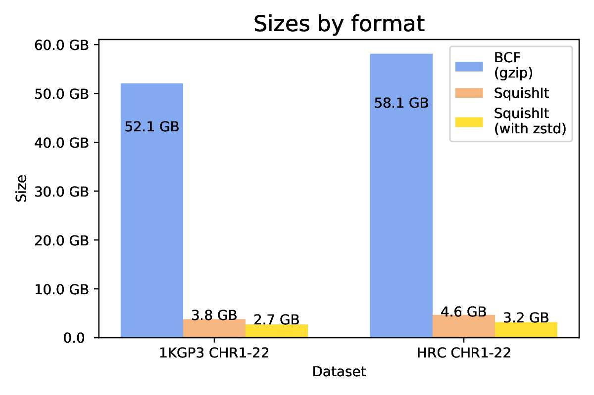
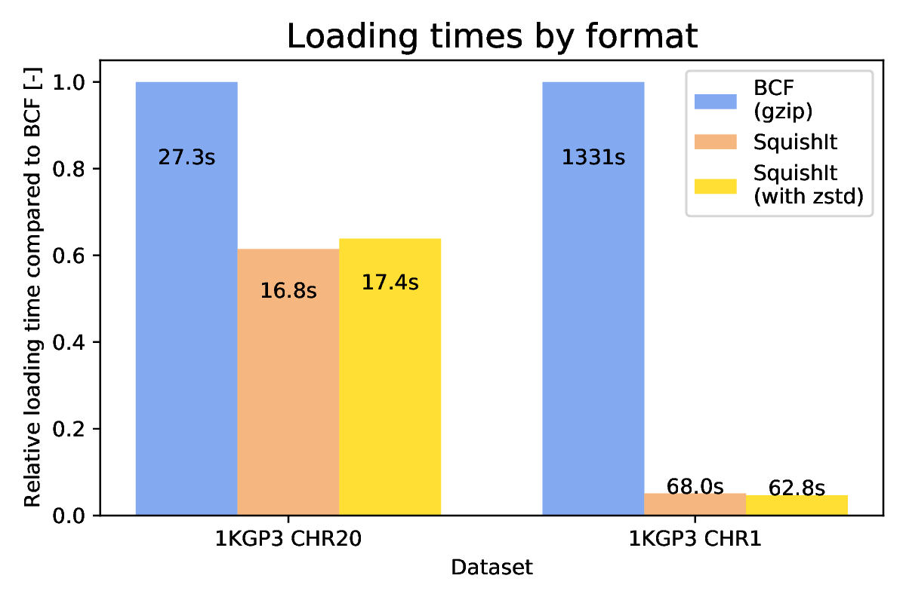

# xSqueezeIt (XSI) - VCF / BCF Genotype Compressor

VCF / BCF Genotype data compressor based on sparse representation for rare variants and positional Burrows-Wheeler transform (PBWT) followed by 16-bit Word Aligned Hybrid (WAH) encoding for common variants. (Minor Allele Frequency threshold is selectable for rare/common variants).

Variant information is left in BCF format to remain compatible with HTSLIB / BCFTools, genotype data is custom encoded as described above. The encoded genotype data can then optionnaly be further compressed with zstd https://github.com/facebook/zstd/.

The compressor was realized with haploid/diploid genotype data in mind (human population genetics data). The compressor supports multi-allelic variant sites. Polyploid samples with ploidy > 2 are not supported yet, mixed ploidy samples are supported (e.g., chrX). The main goal is to provide an alternative file format for storing large human genotype datasets, to reduce loading times and speed-up computation (e.g., with computation on the encoded data directly).

*Note :* This is under development and no stable release / version / tag is available yet. The first stable release will be announced soon.

## Example results

### SHAPEIT4

The `dev` branch on the repository https://github.com/rwk-unil/shapeit4/tree/dev illustrates integration of xSqueezeIt file format support in SHAPEIT4. This serves as an example of how to add xSqueezeIt support in existing tools.

### Compression

Compressing chromosomes 1-22 of 1000 Genomes Phase 3 (1KGP3) https://www.internationalgenome.org/category/phase-3/ (2504 samples, 5008 haplotypes, >88M variants) and chromosomes 1-22 of Haplotype Reference Consortium (HRC) https://www.nature.com/articles/ng.3643 (64976 haplotypes, >39M variants).



### Loading

Loading of the data from file format (right CHR1 is vcf.gz) :



HTSlib is used to get the genotype data into an array for each variant entry (record). With xSqueezeIt the genotype data is extracted from the binary compressed file.

Normal loading with HTSlib and traditional BCF :
```C
bcf_sr_add_reader(reader, "chr20.bcf");
...
while (bcf_sr_next_line (reader)) { // While there are records in the BCF
    ...
    bcf_get_genotypes(header, line, &genotype_array, &ngt); // HTSlib
    ...
}
```

Loading genotype data from xSqueezeIt binary file and associated BCF variant info file :
```C
Accessor accessor("chr20.xsi"); // xSqueezeIt binary compressed file
bcf_sr_add_reader(reader, accessor.get_variant_filename());
...
while (bcf_sr_next_line (reader)) { // While there are records in the BCF
    ...
    accessor->get_genotypes(header, line, &genotype_array, &ngt);
    ...
}
```

## Build

### Building the xSqueezeIt command line tool

This build requires GCC 8+ because modern C++17 features are used.

```shell
# Clone
git clone https://github.com/rwk-unil/xSqueezeIt.git
cd xSqueezeIt

# Clone and build htslib (if you already have htslib set Makefile accordingly and skip)
git submodule update --init htslib
cd htslib
autoheader
autoconf
./configure
make
sudo make install
sudo ldconfig
cd ..

# Clone and build zstd (if you already have zstd set Makefile accordingly and skip)
git clone https://github.com/facebook/zstd.git
cd zstd
make
cd ..

# Build application
make
```

### Generating the xSqueezeIt support library

In order to add support for xSqueezeIt into other software it can be exported as sources to build a library.

```shell
make package-sources
```

This will generate a directory named `xsqueezeit_export` which provides a Makefile to build the `libxsqueezeit` library. The library is built with `g++` but provides a C API as well. To integrate into a C application include the file `include/c_api.h` in you sources and link with `libxsqueezeit.a` using `g++`.

An example is given in the `c_api_test` directory, where a simple C program (`main.c` file) is compiled with `cc` (`gcc`) and linked with the library using `g++`.

Integration into C++ software allows to access the C++ internal API, through any of the `.hpp` files. Since this is the internal API it is not necessarily the easiest to use, but C++ programs can use the C API as well, which is well suited if they use HTSLIB because it is very similar. For an example see : https://github.com/rwk-unil/shapeit4/blob/dev/src/io/genotype_reader2.cpp (which is the genotype reader source of SHAPEIT4 with optional support for xSqueezeIt (`#ifdef __XSI__`).

### Dependencies
This software depends on :
- `htslib` https://github.com/samtools/htslib
- `zstd` https://github.com/facebook/zstd/


## Run

### Compression
- `-c,--compress`

```shell
# ./xsqueezeit <-c|-x> -f <input file> -o <output file>
mkdir output

# Compression :
./xsqueezeit -c -f /path/to/my/data/chr20.bcf -o output/chr20.xsi
# This will output two files in output
# output/chr20.xsi which is the samples and genotype data in binary encoded format (can still be compressed e.g., with gzip)
# output/chr20.xsi_var.bcf which is the variant data, can be opened with bcftools
```

Options :
- `--zstd` Compresses blocks with an extra zstd compression layer (only for version 3)
- `--maf <value>` Sets the minor allele frequency (MAF) for the minor allele count (MAC) threshold that selects if a variant is encoded as sparse or word aligned hybrid (WAH), typical values are around 0.001 give or take an order of magnitude

### Extraction
- `-x,--extract`

```shell
# Extraction (requires both files generated above) :
./xsqueezeit -x -f output/chr20.xsi -o output/chr20.bcf # To compressed BCF
./xsqueezeit -x -f output/chr20.xsi > output/chr20.bcf # Alternative command (uncompressed BCF)
```

#### Region extraction
- `-r,--regions <regions>`
- `-R,--regions-file <filename>`

```shell
# Extraction (requires both files generated above) :
./xsqueezeit -x -r "20:200000-200100" -f output/chr20.xsi -o output/chr20.bcf # To compressed BCF
./xsqueezeit -x -r "20:200000-200100" -f output/chr20.xsi | bcftools view # Pipes uncompressed BCF
# The above command is much faster than decompressing and using -r in bcftools
# because only the chosen regions are decompressed, both generate the same result
```

#### Sample extraction
- `-s,--samples <samples>`
- `-S,--samples-file <filename>`

```shell
# Extraction (requires both files generated above) :
./xsqueezeit -x -s HG00101,NA12878 -f output/chr20.xsi -o output/chr20.bcf # To compressed BCF
./xsqueezeit -x -s HG00101,NA12878 -f output/chr20.xsi | bcftools view # Pipes uncompressed BCF
# List of samples in file
./xsqueezeit -x -S samples.txt -f output/chr20.xsi -o output/chr20.bcf
```

### Pipe into bcftools

```shell
# Or pipe directly into bcftools (some examples) :
./xsqueezeit -x -f output/chr20.xsi | bcftools view | less
./xsqueezeit -x -f output/chr20.xsi | bcftools view -s HG00111,NA12878 | less
./xsqueezeit -x -f output/chr20.xsi | bcftools stats > output/chr20_stats.txt
```

The default output of `xsqueezeit` on `stdout` is BCF, to output VCF and be human readable add `-Ov`, in order to make the above operations faster the `-p` or `-Ou` option can be passed to `xsqueezeit` in order to output uncompressed BCF which is the fastest to pipe into BCFTools as mentioned in their [documentation](https://samtools.github.io/bcftools/bcftools.html#common_options) :

> "Output compressed BCF (b), uncompressed BCF (u), compressed VCF (z), uncompressed VCF (v). Use the -Ou option when piping between bcftools subcommands to speed up performance by removing unnecessary compression/decompression and VCF←→BCF conversion."

Combining this with sample extraction can even speed up analysis for examples running `bcftools roh` (run of homozigosity) :

With BCFTools :
```shell
time bcftools roh -G30 --AF-dflt 0.4 chr1.bcf -s "NA12878,HG00100,HG00101,HG00102,HG00103" > results.txt
# 3:28.22 total
```

xSqueezeIt with `-p` pipe into BCFTools :
```shell
time xsqueezeit -d -f chr1.xsi -s "NA12878,HG00100,HG00101,HG00102,HG00103" -p | bcftools roh -G30 --AF-dflt 0.4 > results.txt
# 1:16.78 total
```

Running without the `-p` option will result in longer execution times because of the unnecessary xsi->VCF (in xSqueezeIt) and VCF->BCF conversions (in BCFTools). Compared to xsi->(uncompressed)BCF that can directly be processed by BCFTools.

xSqueezeIt without `-p` pipe into BCFTools - (Do not do this, better to use `-p` when piping) :
```shell
time xsqueezeit -d -f chr1.xsi -s "NA12878,HG00100,HG00101,HG00102,HG00103" | bcftools roh -G30 --AF-dflt 0.4 > results.txt
# 8:42.54 total
```
### Explore the "variant-only" generated file

The compressor generates a BCF file without the GT data (so variants only) and a binary file with the compressed GT data. This way the BCF file for the variants can still be explored and used.
```
# ./xsqueezeit <-c|-x> -f <input file> -o <output file>

# Compression :
./xsqueezeit -c -f /path/to/my/data/chr20.bcf -o chr20.xsi
# This will output two files
# chr20.xsi which is the samples and genotype data in binary encoded format (can still be compressed e.g., with gzip)
# chr20.xsi_var.bcf which is the variant data, can be opened with bcftools

bcftools view chr20.xsi_var.bcf | less
##fileformat=VCFv4.1
##FILTER=<ID=PASS,Description="All filters passed">
##fileDate=20150218
...
##FORMAT=<ID=BM,Number=1,Type=Integer,Description="Position in GT xsiary Matrix">
##bcftools_viewCommand=view tmp.xsi_var.bcf; Date=Tue Aug 17 16:06:34 2021
#CHROM  POS     ID      REF     ALT     QUAL    FILTER  INFO    FORMAT  BIN_MATRIX_POS
20      60343   rs527639301     G       A       100     PASS    AC=1;AF=0.000199681;AN=5008;NS=2504;DP=20377;EAS_AF=0;AMR_AF=0.0014;AFR_AF=0;EUR_AF=0;SAS_AF=0;AA=.|||;VT=SNP   BM      0
20      60419   rs538242240     A       G       100     PASS    AC=1;AF=0.000199681;AN=5008;NS=2504;DP=19865;EAS_AF=0;AMR_AF=0;AFR_AF=0;EUR_AF=0;SAS_AF=0.001;AA=.|||;VT=SNP    BM      1
20      60479   rs149529999     C       T       100     PASS    AC=17;AF=0.00339457;AN=5008;NS=2504;DP=20218;EAS_AF=0;AMR_AF=0.0043;AFR_AF=0.0106;EUR_AF=0;SAS_AF=0;AA=.|||;VT=SNP      BM      2
```

For example here the AC, AF, AB, etc. entries have not been modified, so they can already be used for some computations, since the BCF file is much smaller than the original one it will faster to process.

This also shows that the compressor keeps all the information that is sometimes lost with other compressors.

In this snippet we can also see the signle `BIN_MATRIX_POS` sample with a `BM` entry. This corresponds to the position of the variant(s) in the binary matrix that is encoded/compressed in the binary file. This allows for random access to the GT data from a given variant in this BCF file. This number is simply a counter of ALT_ALLELES encountered. In the snippet above it increases from 0 to 1 to 2 etc. Multi-allelic variant sites will increase this counter by the number of ALT_ALLELES. For example :

```
20      64139   rs186497980     G       A,T     100     PASS    AC=2,2;AF=0.000399361,0.000399361;AN=5008;NS=2504;DP=20791;EAS_AF=0,0;AMR_AF=0,0;AFR_AF=0,0.0008;EUR_AF=0,0.001;SAS_AF=0.002,0;AA=.|||;VT=SNP;MULTI_ALLELIC     BM      103
20      64150   rs7274499       C       A       100     PASS    AC=102;AF=0.0203674;AN=5008;NS=2504;DP=20555;EAS_AF=0;AMR_AF=0.0058;AFR_AF=0.0741;EUR_AF=0;SAS_AF=0;AA=.|||;VT=SNP      BM      105
```

Where BM increases from 103 to 105 because the previous variant has two ALT_ALLELES A and T.

The `BM` entry allows to extract GT data directly from a region query on the BCF, this is needed to achieve constant time random access. This also helps when because overlapping a region may not be contiguous (e.g., with indels).

** Note : ** Please note that this is for version 3, version 4 uses a little bit different BM index (block:offset) but the idea is similar.

## File Format Description

### Version 4

Will be described soon and will be the version for the first release.

The compressor takes an input BCF and output two files :
1) A BCF file with the original variant info, with following fields (`CHROM POS ID REF ALT QUAL FILTER INFO FORMAT`). These fields are unaltered. And a single sample which holds an index at each variant entry.
2) A binary file `.xsi` with the compressed/encoded information (e.g., "GT" data).

The BCF has the XSI file name in the header and the indices allow to query the data.

### Version 3

#### File organization

This compressor takes an input BCF file and outputs two files :

1) A BCF file with the original variant info, with following fields (`CHROM POS ID REF ALT QUAL FILTER INFO FORMAT`). These field are unaltered (other compressors often replace fields with `.` (missing))
2) A binary file with the "GT" information encoded

Technical details :

the BCF file has a single "sample" `BIN_MATRIX_POS` with a single field `BM` which contains the position of the variant in the "binary matrix" of all variants when encoded as "one-hot" (this is so that multi-allelic variant sites can be encoded efficiently).

The encoded file format has the following organization

| Header                         |
|--------------------------------|
| GT Data Blocks                 |
| Block indices for random access|
| Sample ID's                    |
| Missing positions as sparse    |
| Non standard phase as sparse   |

The header is the main entry point to the file and other data can be accessed from there (offsets to other entries given in header).

##### Blocks

GT Data blocks encode a given number of variants, the offset of each block in the file is given by the block indices, this allows for constant time random access to a block.

The blocks can be compressed with zstd https://github.com/facebook/zstd, a bit in the header indicates if this is the case. If the blocks are compressed two 32-bit words precede each block in memory to indicate the compressed and uncompressed sizes.

Each (uncompressed) block has the following hierarchy :

| Dictionnary |
|-------------|
| Data        |

###### Data
where data are filled with :

| Data                     |
|--------------------------|
| WAH encoded genotypes    |
| Sparse encoded genotypes |
| Binary encoding track    |
| Binary sort track        |

- WAH encoded genotypes are Word Aligned Hybrid encoded genotypes ordered given the sample order until the binary sort track position is "true" where the haplotypes are then reordered given the current variant (Positional Burrows Wheeler Transform).
- Sparse encoded genotypes are the id's of the haplotypes that have the minor allele. (Can be ref or alt, if ref, the number of sparse encodings has MSB bit set, this bit is not used to encode the minor allele, because minor allele means that less than 50% of all haplotypes carry that allele).
- The binary encoding track maps each variant to either a WAH encoding or a sparse encoding.
- The sort track indicates if the following WAH encoded genotypes ordering must be updated by the current variant (PBWT).
Note : the encoding and sort track can be the same track.

###### Dictionnary
The dictionnary is a dictionnary with 32-bit keys and 32-bit values. Terminated by a {-1,-1} key pair ({0xFFFF'FFFF, 0xFFFF'FFFF}).

The dictionnary allows to store the following information :
- Block size, if the block has a smaller size (needed for the last block, because the number of variants is not necesarrily a multiple of block length) this information is put in the dictionnary.
- Offset of the WAH encoded data.
- Offset of the Sparse encoded data.
- Offset of the encoding track.
- Offset of the sort track.
- Other information, if needed by later extension to the format.

##### Sample ID's
A sequence of null terminated strings corresponding to the sample ID's of the input BCF file.

##### Missing positions as sparse
Contains a map of variants positions that have samples with a missing entry "." in BCF/VCF. The samples that have missing entries are encoded as sparse (i.e., list of sample haplotypes that show a missing allele).

##### Non standard phase
The compressor will check out a portion of the input BCF file to see if most samples are phased or unphased. Based on the result the format assumes that most other entries will have samples that are also phased (or unphased).

For each variant where there are samples that are not phased in a mostly phased file (respectively phased in a mostly unphased file). The positions of the samples will be encoded as sparse.

These encoded variant site are then stored in a map as for the missing positions above.

#### Notes

- The missing and non standard phase maps are there to support files that are not entirely phased or unphased as well as files with missing data. Theses files are however not the main focus of this compressor, therefore not much care has been put in the encoding of this. Therefore files with lots of missing data or mixed phase will not benefit from good compression ratios.
- - Improving on this encoding or adding a second compression layer as e.g., zstd could improve this.

### Version 2

**DEPRECATED**

But still supported by compressor / decompressor

#### File organization

This compressor takes an input BCF file and outputs two files :

1) A BCF file with the original variant info, with following fields (`CHROM POS ID REF ALT QUAL FILTER INFO FORMAT`). These field are unaltered (other compressors often replace fields with `.` (missing))
2) A binary file with the "GT" information encoded

Technical details : 

the BCF file has a single "sample" `BIN_MATRIX_POS` with a single field `BM` which contains the position of the variant in the "binary matrix" of all variants when encoded as "one-hot" (this is so that multi-allelic variant sites can be encoded efficiently).

The encoded file format has the following organization

| Header          |
|-----------------|
| Indices WAH     |
| Indices Sparse  |
| WAH data        |
| Sample ID's     |
| Condition track |
| Sparse data     |

The header is the main entry point to the file and other data can be accessed from there

##### Header

The header is 256 bytes long and serves as an entry point for the binary file.

It contains information on the data representation for example the number of bytes used for different representations, e.g., 2 bytes for `uint16_t`.

It contains the offsets (addresses) to the different parts of the file.

The exact C representation can be found below :

```C
struct header_s {
    // "rsvd" fields are "reserved", unused for the moment and kept for future additions

    // 32 bytes
    uint32_t endianness = ENDIANNESS; // Endianness sanity check
    uint32_t first_magic = MAGIC;     // File format sanity check
    uint32_t version = VERSION;       // File format version
    uint8_t  ploidy = PLOIDY_DEFAULT; // Ploidy of samples encoded
    uint8_t  ind_bytes = 0;           // Number of bytes used to save indices
    uint8_t  aet_bytes = 0;           // Number of bytes used to save positions
    uint8_t  wah_bytes = 0;           // Number of bytes used for WAH
    union {
        uint8_t special_bitset = 0;
        struct {
            bool has_missing : 1;     // The input file had missing data
            bool non_uniform_phasing : 1; // The input file has phased / unphased mixed data
            uint8_t rsvd__1 : 6;
        };
    };
    union {
        uint8_t specific_bitset = 0;
        struct {
            bool iota_ppa : 1;        // Reset sort instead of saving permutation arrays
            bool no_sort : 1;         // Data is not permutated
            uint8_t rsvd__2 : 6;
        };
    };
    uint8_t  rsvd_bs[2] = {0,};
    uint32_t rsvd_1[3] = {0,};

    // 64 bytes
    uint64_t hap_samples = 0;         // Number of haplotypes
    uint64_t num_variants = 0;        // Number of variants (total number of ALTs)
    uint32_t block_size = 0;          // DEPRECATED
    uint32_t number_of_blocks = 0;    // DEPRECATED
    uint32_t ss_rate = 0;             // Sub Sample rate of permutation arrays / reset sort rate
    // Offsets, positions of data in the binary file
    uint32_t number_of_ssas = 0;      // Number of sampled loci for random access = ceil(num_variants/ss_rate)
    uint32_t indices_offset = 0;      // Position in the binary file of WAH indices
    uint32_t ssas_offset = 0;         // Position in the binary file of sub sampled permutation arrays (if any)
    uint32_t wahs_offset = 0;         // Position in the binary file of WAH data
    uint32_t samples_offset = 0;      // Position in the binary file of samples (e.g., "NA12878", "HG00101")
    uint32_t indices_sparse_offset = 0; // Position in the binary file of indices for the sparse data
    uint32_t rsvd_offset = 0;
    uint32_t rearrangement_track_offset = 0; // Position in the binary file of the rearrangement track
    uint32_t sparse_offset = 0;       // Position in the binary file of the sparse data

    // 128 bytes
    uint32_t rare_threshold = 0;      // Threshold for the rearrangement track / sorting / wah vs sparse
    uint64_t xcf_entries = 0;         // Num entries in the BCF file (may be less than num_variants if multi-allelic)
    uint8_t rsvd_3[116] = {0,};

    // 32 bytes
    uint32_t rsvd_4[3] = {0,};
    uint32_t sample_name_chksum = 0;; // Checksum unused for now
    uint32_t bcf_file_chksum = 0;     // Checksum unused for now
    uint32_t data_chksum = 0;         // Checksum unused for now
    uint32_t header_chksum = 0;       // Checksum unused for now
    uint32_t last_magic = MAGIC;      // Sanity check magic
} __attribute__((__packed__));
```

##### Indices

Indices allow for random access, they are sampled every `header.ss_rate` variant, they reflect the position of the pointers to the encoded data at the sampled position.

Because sparse data as well as WAH data (similar to RLE) encode a fixed number of bits with a variable number of bits, random access is not directly possible. The indices allow for random access at sampled positions from there access to a given position is possible by traversing the data.

##### Data

Variants are represented internally as bi-allelic 0-1 values (0 is REF) (1 is ALT). The BCF is unaltered in this regard.

Bi-allelic sites with minor allele frequency (MAF) above a given threshold are encoded as WAH, those below are encoded as Sparse (indices of samples with minor allele).

##### Condition track

The condition track represents if a given bi-allelic variant is saved as WAH or as Sparse, as well as, if the variant is used to sort the data.

### Version 1

**DEPRECATED**

- Uses reverse prefix sort, as in the Positional Burrows Wheeler Transform (PBWT), to group related haplotypes together.
- Only uses variants with MAF > 0.01 for sorting
- Can store permutation arrays for random access (costly if many samples) every 8192 variants
- Can reset the sort for faster random access every 8192 variants
  - The sort being reset reduces compression of genotype data but this is offset by the fact that     permutation arrays are not stored
- Encodes the genotype data with Word Aligned Hybrid (WAH) on 16-bits

## Notes / TODO

- Document v4 format and update changes above
- ~~Rename the compressor (currently named console_app ...)~~ Done !
- ~~Only outputs data as phased for the moment~~ Done !
- ~~Handle missing~~ Done !
- ~~Only supports bi-allelic sites for the moment~~ Done !
    - (not needed anymore) Convert multi-allelic VCF/BCF to bi-allelic with bcftools :  
      ```shell
      bcftools norm -m any multi_allelic.bcf -o bi_allelic.bcf -O b
      ```

## Further works

- ~~Extraction~~Done !
- ~~Filtering~~ Done !
- ~~Based on the block compression scheme for faster access~~ Done !
- ~~Based on permutation sub sampling for faster / parallel access~~ Done !